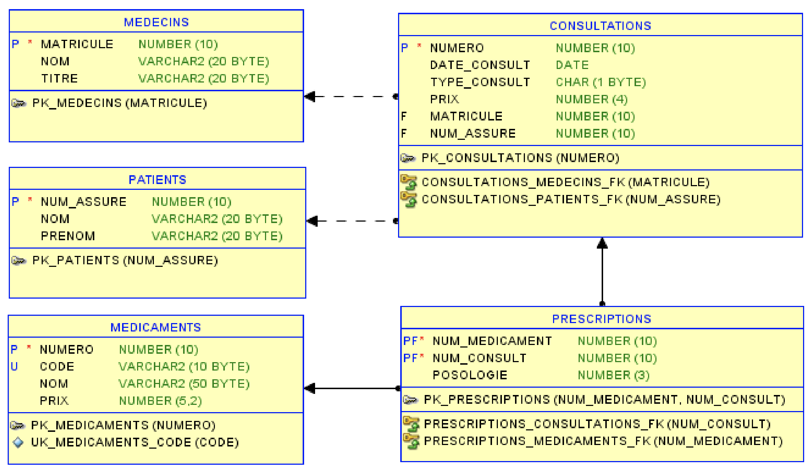

# Instructions

## Exercice 0
Nettoyer votre espace de travail (place nette dans votre schéma). Il est beaucoup plus efficace de travailler par
scripts générés que des clic dans le GUI. Profiter de vous familiariser avec l’outil SQL Developer (éditeur, GUI)
Soit le modèle ci-dessous

## Exercice 1 (rappel / échauffement)
Créer ce schéma (script) puis insérer quelques lignes dans la table médecins et consultations (pour l’exercice 2)

## Exercice 2
Par suite d’une réforme de la LAMAL, le matricule d’un médecin pourra désormais contenir des caractères (ex :
‘CH231298’) et actuellement, notre base de données est prévue pour ne contenir que des chiffres (N10).
Pour préserver tout ennui futur, il est décidé de modifier la clé primaire de la table MEDECINS.
On souhaite :
- Ajouter un attribut numero N(10), qui sera alimenté par une séquence associée et clé primaire de la
table.
- Le matricule du médecin sera alors stocké dans un attribut obligatoire matr_str de type A(10) dont
l’unicité sera garantie. Il contiendra les matricule actuels préfixes par les caractères ‘CH’
Fournir les commandes pour réaliser ces modifications (en sachant que les tables contiennent des données
qu’on ne veut/peut pas perdre)
Remarque : Il existe plusieurs possibilités…